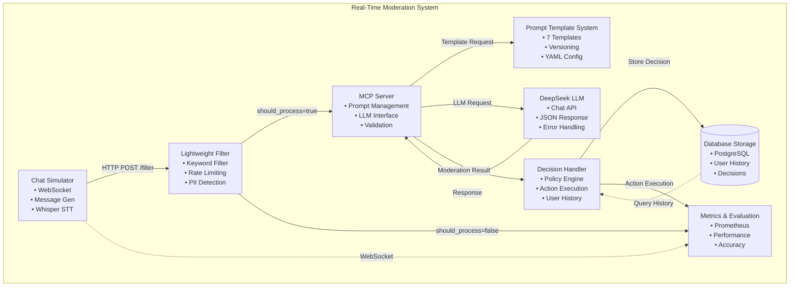
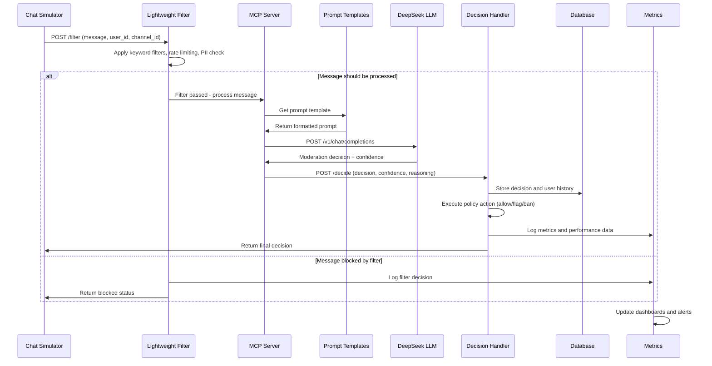
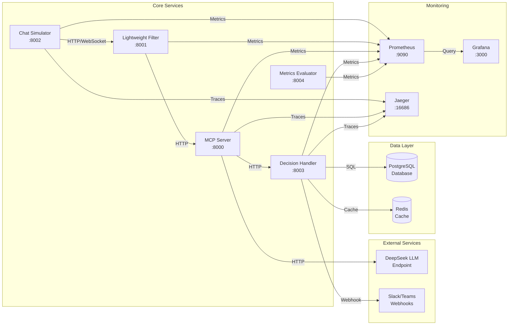
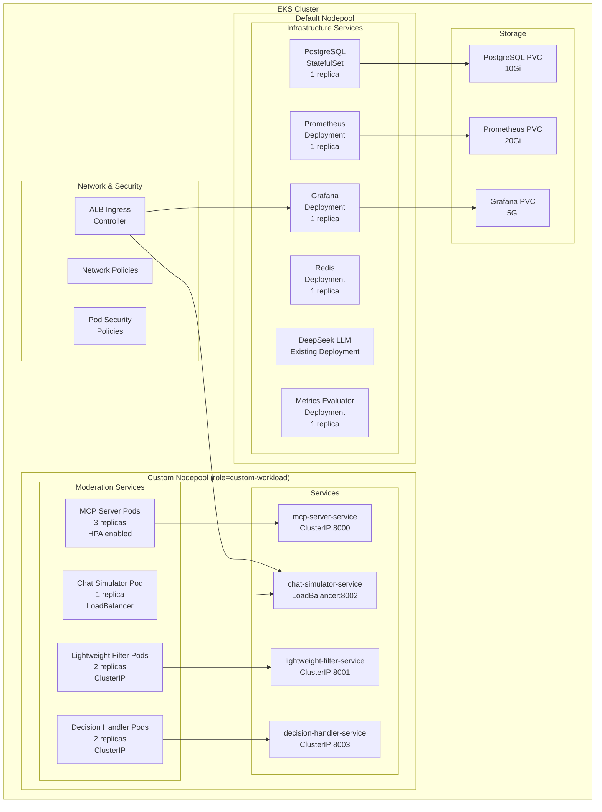
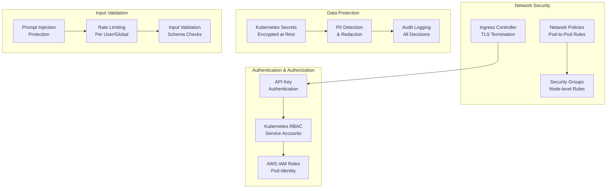

# System Architecture - Mermaid Diagrams

## 1. High-Level System Architecture



## 2. Data Flow Pipeline



## 3. Service Communication Architecture



## 4. Kubernetes Deployment Architecture



## 5. Error Handling and Resilience

```mermaid
graph TD
    subgraph "Circuit Breaker Pattern"
        REQ[Request to LLM]
        CB{Circuit Breaker<br/>State?}
        CLOSED[Closed<br/>Normal Operation]
        OPEN[Open<br/>Fast Fail]
        HALF[Half-Open<br/>Test Request]
        FALLBACK[Fallback Response<br/>Cached/Default]
        
        REQ --> CB
        CB -->|Healthy| CLOSED
        CB -->|Failing| OPEN
        CB -->|Testing| HALF
        OPEN --> FALLBACK
        HALF -->|Success| CLOSED
        HALF -->|Failure| OPEN
    end
    
    subgraph "Retry Strategy"
        FAIL[Request Failed]
        RETRY1[Retry 1<br/>Wait 1s]
        RETRY2[Retry 2<br/>Wait 2s]
        RETRY3[Retry 3<br/>Wait 4s]
        SUCCESS[Success]
        FINAL_FAIL[Final Failure]
        
        FAIL --> RETRY1
        RETRY1 -->|Fail| RETRY2
        RETRY1 -->|Success| SUCCESS
        RETRY2 -->|Fail| RETRY3
        RETRY2 -->|Success| SUCCESS
        RETRY3 -->|Fail| FINAL_FAIL
        RETRY3 -->|Success| SUCCESS
    end
    
    subgraph "Health Checks"
        K8S[Kubernetes Probes]
        LIVENESS[Liveness Probe<br/>/health]
        READINESS[Readiness Probe<br/>/health]
        UNHEALTHY[Unhealthy Pod]
        RESTART[Pod Restart]
        
        K8S --> LIVENESS
        K8S --> READINESS
        LIVENESS -->|Fail| UNHEALTHY
        READINESS -->|Fail| UNHEALTHY
        UNHEALTHY --> RESTART
    end
```



## 6. Monitoring and Observability Flow

```mermaid
graph LR
    subgraph "Application Services"
        APP1[MCP Server]
        APP2[Chat Simulator]
        APP3[Lightweight Filter]
        APP4[Decision Handler]
    end
    
    subgraph "Metrics Collection"
        PROM[Prometheus<br/>Server]
        METRICS[/metrics endpoints]
    end
    
    subgraph "Visualization"
        GRAF[Grafana<br/>Dashboards]
        ALERT[Alert Manager]
    end
    
    subgraph "Tracing"
        JAEGER[Jaeger<br/>Collector]
        TRACES[Distributed<br/>Traces]
    end
    
    subgraph "Logging"
        LOGS[Structured<br/>Logs]
        ELK[ELK Stack<br/>Optional]
    end
    
    APP1 -->|Expose| METRICS
    APP2 -->|Expose| METRICS
    APP3 -->|Expose| METRICS
    APP4 -->|Expose| METRICS
    
    METRICS -->|Scrape| PROM
    PROM -->|Query| GRAF
    PROM -->|Alerts| ALERT
    
    APP1 -->|Send Spans| JAEGER
    APP2 -->|Send Spans| JAEGER
    APP3 -->|Send Spans| JAEGER
    APP4 -->|Send Spans| JAEGER
    JAEGER --> TRACES
    
    APP1 -->|JSON Logs| LOGS
    APP2 -->|JSON Logs| LOGS
    APP3 -->|JSON Logs| LOGS
    APP4 -->|JSON Logs| LOGS
    LOGS -.->|Optional| ELK
```

## 7. Security Architecture



These Mermaid diagrams provide interactive, visual representations of the system architecture that can be rendered in GitHub, documentation sites, and other platforms that support Mermaid syntax.
